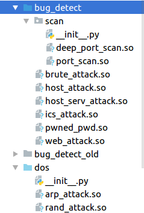

# py2sec

[English Readme](https://github.com/cckuailong/py2sec/blob/master/README_en.md)

py2sec 一款轻量的脚本工具，基于 Cython 将 .py 编译成 run-time libraries 文件：.so (Linux && Mac)，或 .pyd (Win)。一定程度上实现了“加密”保护源代码的需求。

## 系统支持

Linux && MacOS && Windows

注意：Windows用户运行时可能会遇到如下错误

```
error: command 'cl.exe' failed: No such file or directory
```

请安装对应Win系统版本的Visual C++ Build Tools

## py2sec 特性

1. .so / .pyd 文件可以像 .py 模块一样正常调用。例如：`import` 或 `from module import * "`
2. py2sec 可以指定编译单个 .py 文件，也可以指定一个 python 项目目录
3. py2sec 自动识别项目中的 .py 文件，且只编译 .py 类型文件 
4. 可以指定不需要编译的文件或子目录
5. py2sec 不影响源文件，加密后的文件或项目将被存放在 result 文件夹
6. 兼容多平台：macOS、Linux、Windows、
7. 兼容 Python 版本：python2 and python3, 可使用 -p(--py) 参数来指定版本
8. 支持多线程（待改进）

## 环境配置

```
pip install requirements.txt
```

## 使用说明

### 使用

```
python py2sec.py [选项] ...
```

### 选项

```
-v,  --version    显示 py2sec 版本
-h,  --help       显示帮助菜单
-p,  --py         Python的版本, 默认值为 3
                  例: -p 3  (比如你使用python3)
-d,  --directory  Python项目路径 (如果使用-d参数, 将编译整个Python项目)
-f,  --file       Python文件 (如果使用-f, 将编译单个Python文件)
-m,  --maintain   标记你不想编译的文件或文件夹路径
                  注意: 文件夹需要以路径分隔符号（`/`或`\\`，依据系统而定）结尾，并且需要和-d参数一起使用 
                  例: -m setup.py,mod/__init__.py,exclude_dir/
-x  --nthread     编译启用的线程数
```

```
python py2sec.py -f test.py
python py2sec.py -f example/test1.py
python py2sec.py -d example/ -m test1.py,bbb/
```

### 项目结构

- build/              临时文件夹, .o, .so 文件
- tmp_build/          临时文件夹, .c 文件
- result/             编译最终结果存放目录
- result/log.txt      编译过程日志
- py2sec.py           主函数文件
- py2sec_build.py.template   用于生成 py2sec_build.py 的模板文件
- requirements.txt    依赖库的清单

### 示例

整个Python项目编译前:


py2sec 编译后效果:


